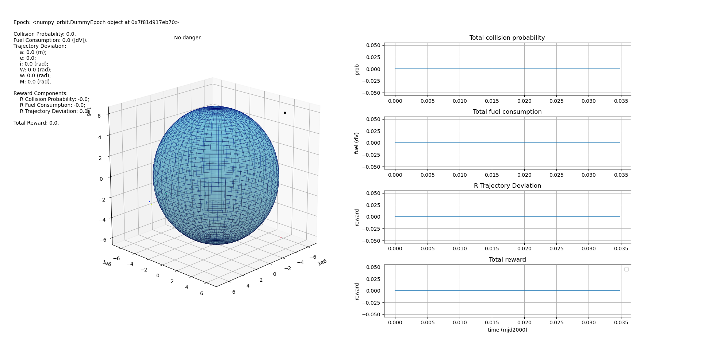
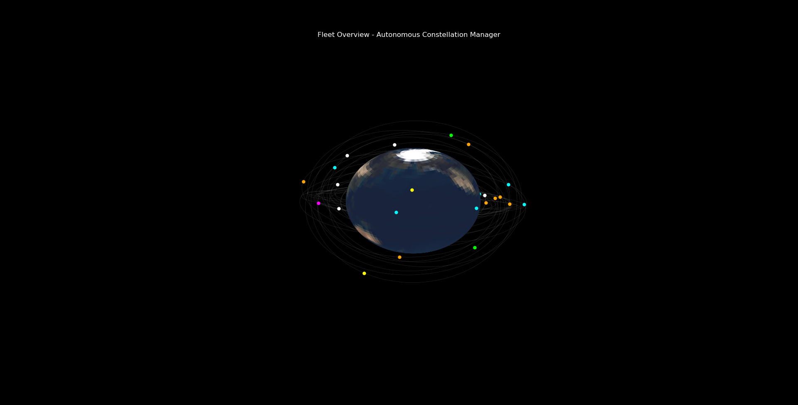

# Autonomous Constellation Manager

## Motivation

As the deployment of massive global satellite constellations (like Starlink and OneWeb) accelerates, Low Earth Orbit (LEO) is becoming increasingly dense. The number of active objects in space leads to a significantly higher probability of catastrophic conjunctions, and manual processing of these collision threats is no longer scalable.

In this project, we have architected and developed the **Autonomous Constellation Manager (ACM)**—a centralized, high-performance "brain" for fleet-wide satellite management. Moving beyond manual scripts, this system utilizes real-time API integrations, autonomous maneuver rules, and predictive spatial optimization to ensure the safety of over 50 active satellites navigating alongside tens of thousands of tracked space debris fragments.

||
|:--:| 
|Real-time Simulation of Autonomous Evasive Maneuvers|

## Features

- **Live Telemetry Ingestion:** The engine dynamically pulls live Earth-Centered Inertial (ECI) orbit data from the CelesTrak API in real-time, mapping active satellites and debris. 
- **Hardware-Accelerated Backend:** Uses multi-layered arrays driven by `numpy` and `pykep` bindings, calculating spatial distances instantly to satisfy resource-constrained operational requirements.
- **Autonomous Collision Evasion Rules:** Leverages a lightweight `HackathonAgent` that evaluates conjunction distances. If an intersection breaches the safety threshold, the system automatically sequences and fires a pre-calculated Delta-V maneuver vector.
- **Real-Time 3D Visualization:** Seamlessly maps the fleet across a high-fidelity Earth texture using Matplotlib grids alongside live dynamic telemetry plots tracking total rewards, collision probability drops, and fuel consumption dynamically! 

## Installation

### Prerequisites

Ensure you are running **Python 3.6+** in your environment. You will need the following core libraries installed natively:
* `numpy`
* `pandas`
* `pykep`
* `matplotlib`
* `scipy`
* `requests` (for Live API parsing)
* `Pillow` (for 3D Earth mapping)

### Setup & Requirements

**Step 1:** Clone the repository to your local machine:
```bash
git clone https://github.com/your-username/Autonomous-Constellation-Manager.git
cd Autonomous-Constellation-Manager
```

**Step 2:** Install all Python requirements using the text pipeline:
```bash
pip install -r requirements.txt
```

**Step 3:** Install the package framework:
```bash
python setup.py develop
```

## Running the MVP Demo

Once the environment is successfully configured, you have two different ways to launch the architecture, depending on your presentation goal:

### 1. Functional System & Telemetry Simulation (Metrics focus)
To run the full backend pipeline and verify the automated reinforcement-learning collision evasion arrays are executing:
```bash
python -m examples.test_flight
```
**What to expect:** The terminal will dynamically ping the CelesTrak API for LIVE satellite orbital tracking! A 3D solid-shaded globe window will appear on-screen alongside real-time Matplotlib metric dashboards, reacting actively as autonomous Delta-V deflections optimize Constellation paths.

### 2. Cinematic Fully-Textured Fleet Revolver (Graphics focus)
To load a gorgeous, fully graphic rotating texture-map of the Earth wrapped with dozens of independently tracked orbital trajectories smoothly rotating automatically:
```bash
python -m examples.visual_demo
```
||
|:--:| 
|Real-time Simulation of Autonomous Evasive Maneuvers|
**What to expect:** A stunning cinematic loop! The engine natively downloads a high-fidelity planetary map, wraps it seamlessly across a 3D spherical point-mesh matrix, and continuously revolves the camera showing colored orbital payload indicators rotating in active 3D space with zero metric-graph clutter.
